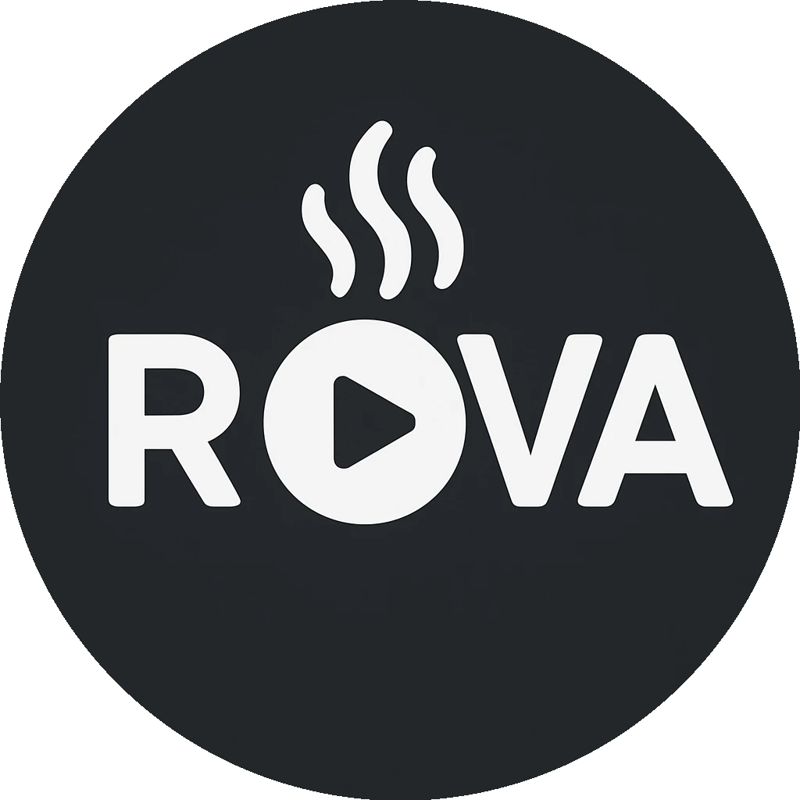
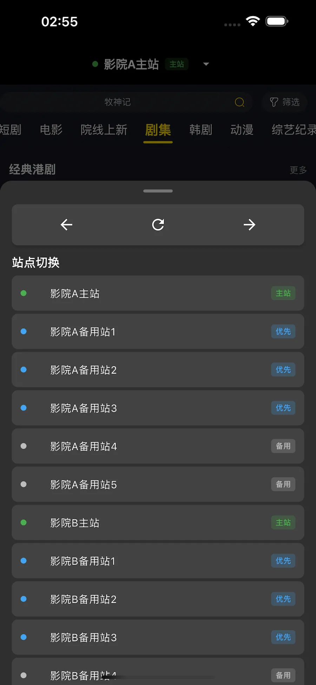

    

 

    <h1>嗅影</h1>

嗅影是一款集 **浏览器组件 + 视频嗅探 + 自动播放** 功能于一体的免费影视播放器，专注于提供 **无缝、纯净、安全** 的观影体验。

---

# 预览
### 移动端

 

 

 

 

### PC 端

 

 

 

 

 

## 🚀 功能特性

### 🔍 指定站点访问

* 内置 WebView 浏览器，仅支持访问预设的影视网站。
* 确保资源来源稳定，避免无效链接和低质资源。

### 🤖 智能嗅探 + 自动播放

* 自动识别网页中的视频链接，支持多种主流视频格式。
* 一键调用原生播放器播放，无需复制链接或手动操作。
* 实现“浏览 → 嗅探 → 播放”全流程无缝衔接。

### 🛡️ 安全优化

* 自动屏蔽网页中的不健康广告和弹窗。
* 过滤潜在的恶意脚本，确保访问与播放过程的安全。
* 提供更纯净的影视浏览环境。

### 🛠️ 基础功能

* 支持多种视频格式的嗅探与播放。
* 简洁直观的界面，专注核心流程。

---

## 📱 平台支持

* **iOS**：支持安装，但需要用户自签名应用。
* **Android**：完整支持。
* **macOS**：完整支持。
* **Windows**：完整支持。
* **TV 平台**：~~暂不支持，后续也无计划支持 TV 端。~~

---

## 📢 免责声明

嗅影 **不存储、不制作、不上传、不分发** 任何影视内容。  
所有视频资源均来自用户访问的第三方网站，工具仅提供 **浏览、嗅探与播放** 功能，  
不对内容的合法性、完整性或版权负责，请在遵守相关法律法规的前提下使用。  

⚠️ **嗅影不提供、不适配任何成人（18+）网站或相关内容**，请用户自觉遵守法律法规，  
禁止将本工具用于访问、传播或制作违法违规内容。

📌 **本项目仅供学习与技术研究使用，不得用于任何商业用途。**

## 🔒 代码不开源声明

本项目当前为 **闭源软件**，不开源的目的包括但不限于：  

* **防止被滥用**：避免代码被非法改造，用于传播违规内容。  
* **保证产品质量**：确保功能一致性，避免第三方修改造成体验分裂。  
* **保证产品安全**：所有构建过程均通过 GitHub Actions 完成，用户可查看完整构建日志以验证安全性。

📌 **是否开源将根据项目成熟度和社区反馈进行评估。**